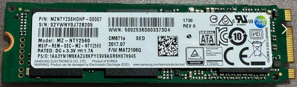

# Panasonic CF-LX5

> 型号：CF-LX5PDP6S
>
> | 型号        | 内存容量       | BIOS     | 备注                |
> | ----------- | -------------- | -------- | ------------------- |
> | CF-LX5PDP6S | 8GB+256GB(SSD) |          | 送 小高的天津朋友了 |
> | CF-LX5PDT5S | 4GB+128GB(SSD) | V3.00L25 | 2024.11-最新        |

## 1. 设备配置

> 参照：Panasonic CF-LX5PDP6S.pdf

- 设备配置表：

  | 项目 | 配置                                                         | 备注                 |
  | ---- | ------------------------------------------------------------ | -------------------- |
  | CPU  | Core i5 6300U(Skylake)/2.4GHz/2コア                          | 3239                 |
  | 内存 | 8GB LPDDR3 SDRAM（拡張スロットなし）                         |                      |
  | 硬盘 | SSD*:256GB（Serial ATA）                                     |                      |
  | 屏幕 | 14.0型（16:9）Full HD 広視野角液晶（1920×1080ドット）アンチグレア | 解像度:Full HD 1080p |
  | 无线 | インテル® Dual Band Wireless-AC 8260                         |                      |
  | 蓝牙 | Bluetooth v4.0（Windows 10 Pro使用時はBluetooth v4.1）       |                      |
  | 安全 | TPM（TCG V1.2準拠）                                          |                      |
  | 尺寸 | 幅333mm×奥行225.6mm×高さ24.5mm（突起部除く）                 |                      |
  | 重量 | 約1.21kg（付属のバッテリーパック（S）（約190g）装着時）<br />电源：約220g（電源コード（約60g）除く） |                      |

- CF-LX5PDT5S

  | 项目 | 配置                                  | 备注 |
  | ---- | ------------------------------------- | ---- |
  | 硬盘 | HDD：HGST HTS545032A7E680 （8MB缓存） |      |
  |      |                                       |      |
  |      |                                       |      |

  

## 2. 驱动更新

- BIOS  
  https://jp-pc-support.connect.panasonic.com/dldocs/105103  
  当前（2024年11月）的最新版本是 `V3.00L25` 。

- 官方驱动

  https://askpc.panasonic.co.jp/s/download/install/lx5.html

- WIN10更新之后，缺乏的驱动都是属于 `Intel` 的相关内容。

  需要注意的是 `ME` 的版本，最新的话，电脑很容易宕机。

### 2.1 ME 固件

> `Intel® Converged Security and Management Engine` 或　`Intel Management Engine Software`  
> 固件更新需要到电脑生厂商的网页下载

- ME 固件（firmwire）更新：

  https://www.intel.cn/content/www/cn/zh/support/articles/000025619/software.html

## 3. 硬件升级

### 3.1 内存增设

> 内存是焊接在主板上的，无法增加。

### 3.2 硬盘更换

> 电脑原装的硬盘信息：
>
> ```
> Model                 FirmwareRevision
> -----                 ----------------
> TOSHIBA THNSNF128GCSS FSPAN102
> ```
>
> ※ *感觉东芝的 SSD 的磁盘效果就是很好，磁盘的 `平均响应时间` 非常短。*

- SATA
- m2.SATA

#### `MZNTY256HDHP-00007`

- `CF-LX5PDP6S`  
  `CM871a`  
    
  估计是该磁盘前部有坏簇，所以导致系统总是崩溃、蓝屏。

## 4. 系统安装

### 4.1 无法找到系统

- 原因描述

  安装过程中，出现错误，因为是 `UEFI` 方式，再启动的时候，BIOS会自动选择 HDD 进行启动。   
  然而，因为系统未能安装成功，所以导致出现 `An operating system wasn't found.`，无法启动。

- 解决方案

  进入 `BIOS` 设置，开启 `Popup Menu`;  
  再次启动，按 `ESC` 键，这样就可以选择从 `USB硬盘` 方式启动，再次进行安装。

  > 注意：BIOS未更新之前，可能是 USB3.0 的支持不是很好，所以在安装到 81% 的时候，无法继续前进，然后出现安装错误的错误。  
  > 把 USB硬盘，插入 USB2.0 的端口，就可以正常安装结束。

### 4.2 安装 `winget`

- 首先更新 `Microsoft Store`

  不更新的话，无法找到 `winget` 项目

## 5. 进入BIOS

- 开机时，按 `F2` 或者 `Del` 键，可以进入 BIOS 设置。

## 6. 系统重新安装

- 不能靠设置 BIOS 的启动顺序，使用 USB 重新安装系统。
- 在 BIOS 最后的页面，里面有重启选择项，在这里选择启动用设备。  
  这概念挺奇怪的，为啥和其它厂家的处理存在这么大的差距，为了找这个选择USB重启，折腾了太多时间，还以为是主板发生错误了呢。

## 7. 驱动更新

### 7.1 CF-LX5PDP6S

- Windows10 安装之后，未能正确识别的设备列表：  

  > https://askpc.panasonic.co.jp/s/download/install/lx5.html  
  >  注：要首先安装 `INTEL芯片组驱动` 之后，再安装其它驱动。

  |  #   | 名称                         | 硬件ID                                       | 驱动 | 真实设备名 |
  | :--: | ---------------------------- | -------------------------------------------- | ---- | ---------- |
  |  1   | PCI 串行端口                 | PCI\VEN_8086&DEV_9D3D&SUBSYS_833810F7&REV_21 | ※2   |            |
  |  2   | PCI 简单通讯控制器           | PCI\VEN_8086&DEV_9D3A&SUBSYS_833810F7&REV_21 | ※2   |            |
  |  3   | PCI 内存控制器               | PCI\VEN_8086&DEV_9D21&SUBSYS_833810F7&REV_21 | ※1   |            |
  |  4   | PCI 数据捕获和信号处理控制器 | PCI\VEN_8086&DEV_1903&SUBSYS_833810F7&REV_08 | ※3   |            |
  |  5   | PCI 数据捕获和信号处理控制器 | PCI\VEN_8086&DEV_9D31&SUBSYS_833810F7&REV_21 | ※1   |            |
  |  6   | SM 总线控制器                | PCI\VEN_8086&DEV_9D23&SUBSYS_833810F7&REV_21 | ※1   |            |
  |  7   | 未知设备                     | ACPI\VEN_INT&DEV_3400                        | ※3   |            |
  |  8   | 未知设备                     | ACPI\VEN_INT&DEV_3403                        | ※3   |            |
  |  9   | 未知设备                     | ACPI\VEN_INT&DEV_3402                        | ※3   |            |
  |  10  | 未知设备                     | ACPI\VEN_INT&DEV_3403                        | ※3   |            |
  |  11  | 未知设备                     | ACPI\VEN_INT&DEV_3403                        | ※3   |            |
  |  12  | 未知设备                     | ACPI\VEN_INT&DEV_3403                        | ※3   |            |
  |  13  | 未知设备                     | ACPI\VEN_INT&DEV_3403                        | ※3   |            |
  |  14  | 未知设备                     | ACPI\VEN_INT&DEV_3404                        | ※3   |            |
  |  15  | 未知设备                     | ACPI\VEN_INT&DEV_3406                        | ※3   |            |
  |  16  | 未知设备                     | USB\VID_8087&PID_0A2B&REV_0001               | ※4   |            |

  ※1 `INTEL芯片组驱动`  
  ※2 `Intel Management Engine Software`  
  ※3 `Intel(R) Dynamic Platform and Thermal Framework (Intel(R) DPTF), Client Version 8.X`  
  ※4 `Bluetooth software for Intel 9560/8265/8260/7265/7260 (for win10)`

- 网卡的驱动，可以网上搜索 `intel 8260` 找到最新的驱动。  
  后者直接在 INTEL 官方网站下载 `驱动程序和支持助理`：  
  　日文：https://www.intel.co.jp/content/www/jp/ja/support/detect.html  
  　中文：[英特尔® 驱动程序和支持助理 (intel.cn)](https://www.intel.cn/content/www/cn/zh/support/detect.html)  
  　对 网卡 和 无线网卡 的驱动进行更新，更新之后，至少 远程桌面 感觉更加流畅（其实不会有感觉）。

### 7.2 CF-LX5PDT5S

和 `LX5PDT6S` 的区别是，内存只有 4GB，且 SSD 也只有 128GB，运行 WIN10 和 WIN11 稍微有压力，尤其是有大型 Windows 更新的时候，因为内存不足，会很花费时间。


#### Windows11安装

安装之后安装如下驱动：

- INTEL INF
- INTEL驱动安装助手
- INTEL ME  
  INTEL 官方下载
- Intel(R) Dynamic Platform and Thermal Framework (Intel(R) DPTF), Client Version 8.X  
  Panasonic官方下载
