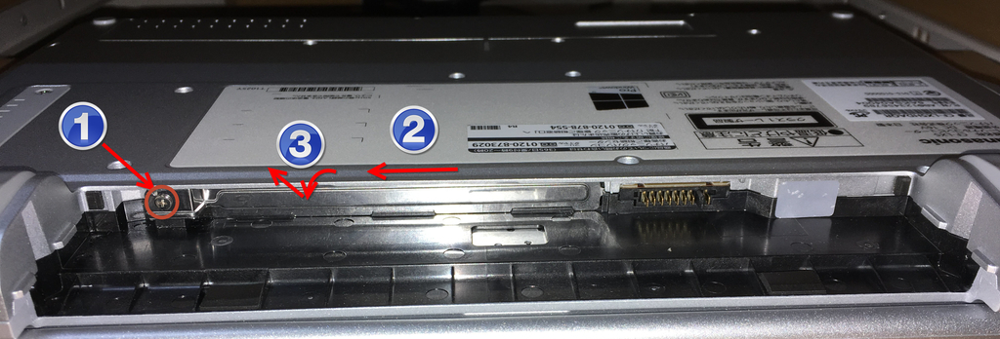

# Panasonic CF-SZ5

> CF-SZ5PDA5S

## 1. 设备配置

|          |                                                              |      |
| -------- | ------------------------------------------------------------ | ---- |
| CPU      | Intel Core i5-6300U @ 2.40GHz                                |      |
| 硬盘     | SSD 256GB                                                    |      |
| BIOS更新 | https://jp-pc-support.connect.panasonic.com/dldocs/105106?utm_source=chatgpt.com |      |

CT250MX500SSD1：`Crucial MX500 250GB 3D NAND SATA 2.5インチ 7mm（9.5mmアダプター付き）`

## 2. 驱动更新

- BIOS

  https://jp-pc-support.connect.panasonic.com/dldocs/105106
  
  | 型号        | BIOS     | 备注                              |
  | ----------- | -------- | --------------------------------- |
  | CF-SZ5PDA5S | V3.00L25 | 2024.11.27：（V3.00L10→V3.00L25） |
  | CF-SZ5PDY6S | V3.00L25 | 给小高天津的朋友了。              |
  
  ※ 当前（2024年11月）的最新版本是 `V300L25`。

## 3. 硬件升级

### 3.1 内存增设

`On Board` 所以，无法增设内存。

### 3.2 硬盘更换

- 取出电池并卸下硬盘弹出盖。  
    
  1. 拆下螺丝。
  2. 将盖子滑向左侧。
  3. 将盖子的顶部向您倾斜，然后沿对角线将其取下。

## 4. 系统安装